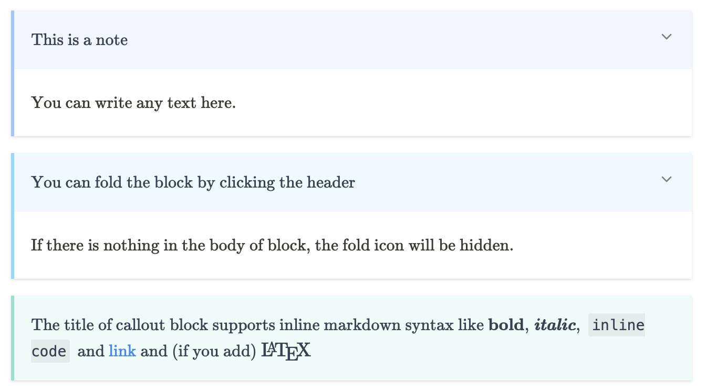

# mdit plugin callouts

[](https://www.npmjs.com/package/mdit-plugin-callouts)

This is a plugin for [vite](https://vitejs.dev) that support callout blocks. The callout block is inspired by [Obsidian](https://obsidian.md).

## Example



For more examples, view them on my personal [blog](https://widcard.win/posts/updater_tutorials/c04_update_from_func).

## Installation

#### Step 1. Install the plugin

Install the plugin with npm/yarn/pnpm.

```sh
npm install mdit-plugin-callouts
```

Import it into _vite.config.ts_

```ts
// vite.config.ts
import CalloutPlugin from 'mdit-plugin-callouts'
export default defineConfig({
  plugins: [
    Markdown({
      // ...
      markdownItSetup(md) {
        md.use(CalloutPlugin)
      }
    })
  ]
})
```

#### Step 2. Import css

Import css into the entry file _main.ts_

```ts
// main.ts
import 'mdit-plugin-callouts/index.css'
```

If you are using vitepress, you should notice the [docs](https://vitepress.vuejs.org/guide/theme-introduction#using-a-custom-theme). You are supposed to import the css file in _docs/.vitepress/theme/index.ts_, not in _docs/.vitepress/config.ts_.

```ts
// docs/.vitepress/theme/index.js
import DefaultTheme from 'vitepress/theme'
import 'mdit-plugin-callouts/index.css' // <-- css files should be imported here

export default {
  ...DefaultTheme,
  enhanceApp({ app }) {
    // ...
  },
}
```

## Usage

Basic usage.

```markdown
> [!note] This is a note
> This is the body of callout block.
>
> You can write more lines.
```

If you do not want the callout body, just write the title, and the fold icon will be hidden.

```markdown
> [!tip] Callout without body
```

All of the callout blocks are *expanded* by default, except the _example_ block. However, you can change it mannually.
If you want to fold the block by default, you can write `open` or `closed` in the options.

```markdown
> [!info|closed] The block will be folded by default.
> You can click the header to expand it.
```

The following callout types are supported.

|Type	|Aliases|
|-------|-------|
|note	|note, seealso|
|abstract	|abstract, summary, tldr|
|info	|info, todo|
|tip	|tip, hint, important|
|success	|success, check, done|
|question	|question, help, faq|
|warning	|warning, caution, attention|
|failure	|failure, fail, missing|
|danger	|danger, error|
|bug	|bug|
|example	|example|
|quote	|quote, cite|

## License

[MIT](./LICENSE) License © 2022 [widcardw](https://github.com/widcardw)
